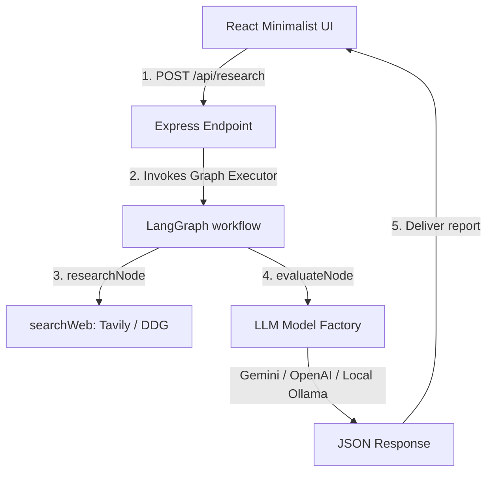

# AI Investment Research Agent • [Demo](https://investify-drab.vercel.app/)

A lightweight, minimalist full-stack application that acts as an **AI Investment Research Agent**. It takes a company name, queries the web for live background/financial details, and delivers an instant investment recommendation (**INVEST** or **PASS**) with a clear reasoning thesis.

Built using **React + Vite** (frontend), **Express + Node.js** (backend), and **LangChain.js + LangGraph.js** (AI workflow manager).

---

## 🌟 Overview (What it Does)

The AI Investment Research Agent automates company due diligence in 3 simple stages:
1. **Target Identification**: User inputs a company name (e.g. *Tesla*, *Nvidia*, *Mahindra*).
2. **Web Scrape & Synthesis**: The backend queries search engines (Tavily or free DuckDuckGo fallback) to grab recent overview details, financials, and competitors, returning a brief summary.
3. **Evaluation Node**: The agent runs the search context through a 2-stage LangGraph workflow:
   - **`research`**: Aggregates search snippets (capped to top 3 hits and truncated to save token usage).
   - **`evaluate`**: Feeds the context into the LLM (Gemini, OpenAI, or **Local Llama**) to generate a summary description and issue the final Invest/Pass recommendation with its thesis.

---

## ⚙️ How to Run It (Setup & Run Steps)

### Step 1: Clone and Configuration
1. Open the project directory:
   ```bash
   cd iim
   ```
2. Configure the backend variables in `backend/.env` (optional, since keys can also be typed directly in the Web UI settings):
   ```env
   PORT=5000
   GEMINI_API_KEY=your_gemini_api_key_here
   OPENAI_API_KEY=your_openai_api_key_here
   TAVILY_API_KEY=your_tavily_api_key_here
   ```

### Step 2: Running Llama locally with Ollama (Optional & Key-Free!)
If you are running out of Google/OpenAI API quota limits, you can run Llama locally on your CPU/GPU for free:
1. Download and install **Ollama** from [ollama.com](https://ollama.com).
2. Open your terminal and download/run the lightweight Llama model (e.g. Llama 3.2 3B):
   ```bash
   ollama run llama3.2
   ```
3. Once running, Ollama hosts its API locally at `http://localhost:11434`.
4. In our Web UI settings, select **Local Llama (Ollama)** as the LLM provider. No API key is required!

### Step 3: Run the Application
1. Install all dependencies for the root, frontend, and backend in one step:
   ```bash
   npm run install:all
   ```
2. Start the dev servers concurrently:
   ```bash
   npm run dev
   ```
3. Open your browser and navigate to:
   **`http://localhost:5173`**

---

## 🧠 How it Works (Approach & Architecture)

The simplified design focuses on reliability, speed, and token conservation:



### LangGraph Agent State
We define a highly efficient 2-node graph state using standard LangGraph channels:
```javascript
const stateChannels = {
  companyName: valueReducer,
  searchContent: valueReducer,
  companyInfo: valueReducer,
  decision: valueReducer,
  reasoning: valueReducer
};
```

---

## 🛠️ Key Decisions & Trade-Offs

### 1. Unified REST API (`POST`) instead of SSE Streams
- **Decision**: Replaced Server-Sent Events (SSE) logs with a direct POST request.
- **Why**: SSE connections add latency, handshake complexity, and can disconnect due to local network settings. A direct POST request completes the entire evaluation in a single fast trip (3-10s) and is extremely stable and beginner-friendly.

### 2. Cap search inputs to bypass Quota Exhaustion (429 Errors)
- **Decision**: Truncated search snippets to 350 characters and limited results to the top 3 hits.
- **Why**: Gemini's free tier limits input tokens to 250,000 per minute. Compiling large search documents easily hits this limit in multi-agent workflows. Capping the search context size guarantees you stay well within the free token rate limits.

### 3. Solid Flat Minimalist CSS Theme (No Gradients)
- **Decision**: Removed all glowing shadows, neons, glassmorphic blur layers, and radial color circles.
- **Why**: Simplifies design loading overhead, matches solid-style developer platforms (like GitHub), and improves readability by focusing on core report cards.

### 4. Custom Local Llama Client
- **Decision**: Avoided pulling in heavyweight npm packages like `@langchain/ollama` and wrote a custom Axios client class emulating the LangChain interface.
- **Why**: Prevents ESM/CommonJS dependency conflicts on Vite compilers and allows local Llama models to integrate seamlessly without bloated package installations.
